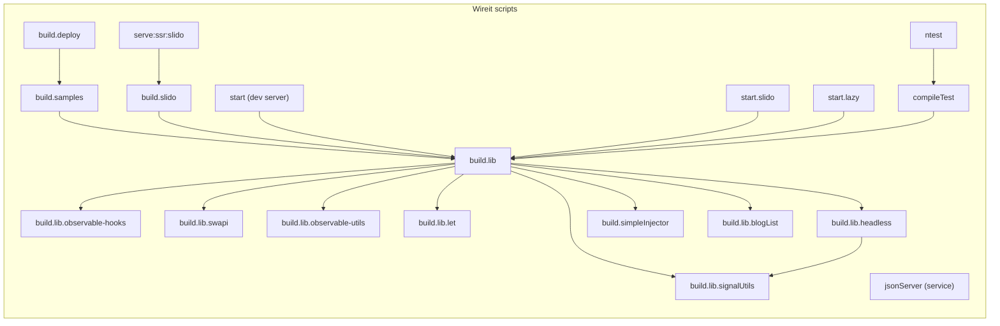

# Sanders Samples project

This is my mono-repo where I do quick experiments and samples. Also, this is where I keep my public libraries. Usually this is kept on the latest versions off all packages, and the source in here is experimental. Also it's only targeting evergreen browsers.
Code is provided as-is, and there are no guaranties.

wI'm using `pnpm` in this repo.

## first step

The samples use some of my personal libraries, those are also in this mono-repo, and you need to build them before the sample will work
you can do so by running:

```bash
pnpm build.lib
```

## Development server

Run `pnpm run start` for a dev server. Navigate to `http://localhost:4200/`. The app will automatically reload if you change any of the source files.

If you have any questions or remarks, feel free to contact me.

## Wireit (task orchestration) 🔁

This repository uses **Wireit** (see the `wireit` section in `package.json`) to orchestrate scripts such as `start`, `build.lib`, `ntest`, and `compileTest`.

- Run tasks with `pnpm run <task>` (examples: `pnpm start`, `pnpm ntest`).
- Wireit features used here: incremental builds, parallel execution, local caching (`.wireit`), and watch mode (`--watch`).
- In CI you can enable GitHub Actions caching with `google/wireit@setup-github-actions-caching/v2`.

> Tip: add `.wireit/` to `.gitignore` if you don't want local cache artifacts committed.

### Wireit dependency graph (Mermaid)

Below is a visual representation of the repository's Wireit task dependencies. Arrows point from a script to the scripts it depends on (i.e. the scripts that must run first).



> Note: the diagram shows Wireit scripts and their inter-dependencies (not every npm dependency). Use this to understand which build steps run before others.

## For AI assistants 🤖

- **Always** read and prioritize `TESTING.md` (canonical testing instructions), `lmm-angular.txt` (Angular style guide), and `package.json` (check the `wireit` section) when answering questions or suggesting code/CI changes.
- Preferred test commands: `pnpm test` or `ng test samples --watch=false`. Coverage output: `coverage/<project>/index.html`.
- Before proposing changes, check `package.json`, `angular.json`, and `TESTING.md`, and report which files were consulted.

(See `copilot-instructions.md` for machine-readable assistant guidance.)
