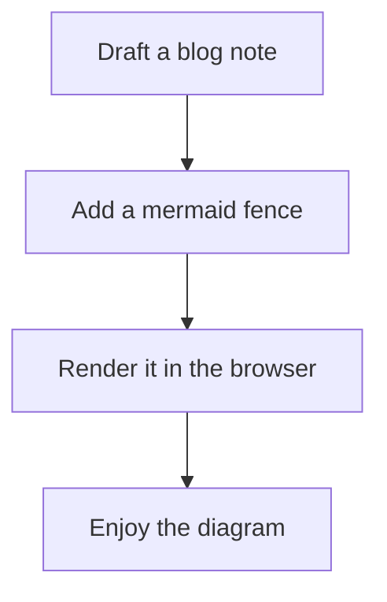

# List of things still to do

This is a small file to remind myself of the things I
still want to do in this project.

This post also doubles as a quick mermaid rendering sample:

- [x] add some initial blog articles
- [x] make blog articles show up in the meta data service
- [x] make blog articles have dynamic routes
- [x] make blog articles have proper meta tags (title, description, image, etc)
- [x] make blog articles have proper open graph tags
- [x] make blog articles have proper twitter card tags
- [x] statistics for website
- [ ] make blogs more personal, and add author info
- [ ] create a way for readers to do tags and category suggestions
- [ ] make tags filterable
- [ ] add RSS feed for blogs
- [ ] add comments to blogs
- [ ] Make a "related articles" section under each blog based on tags
- [ ] add a "most popular articles" section in the sidebar (once statistics are available)
