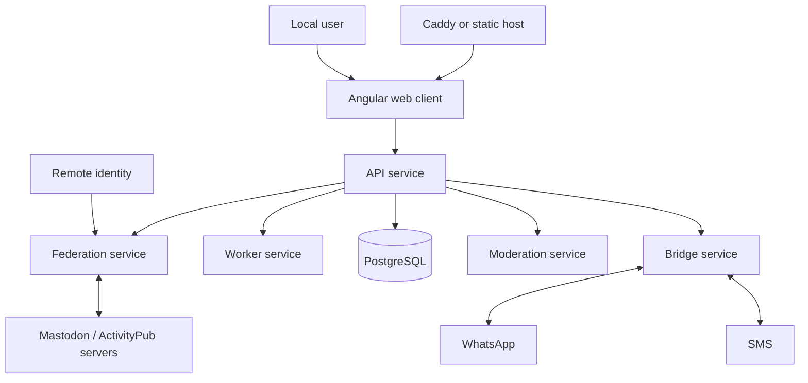
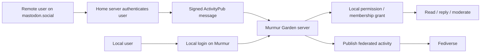
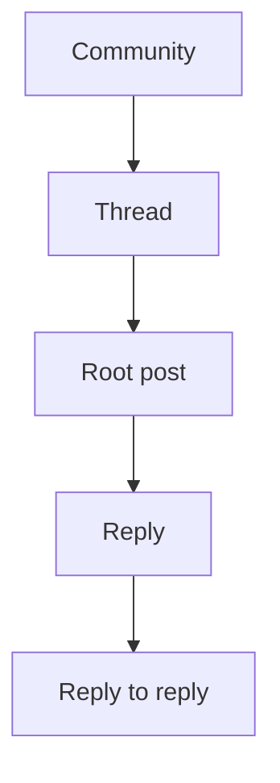
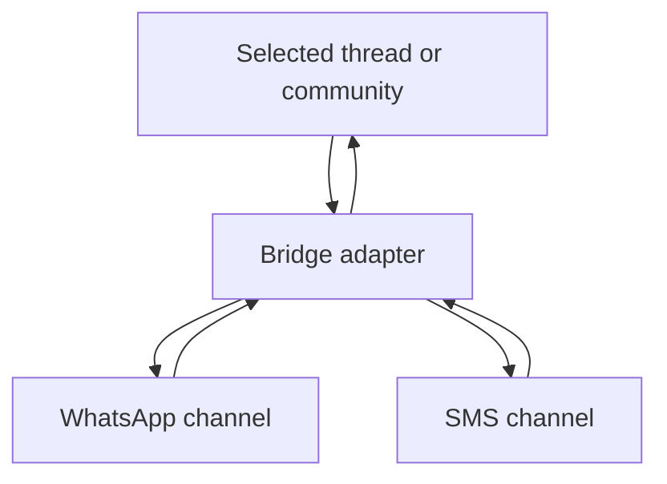
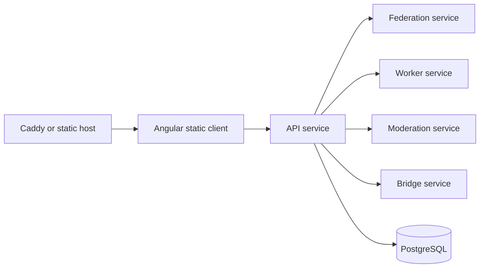

# Murmur Garden diagrams

These diagrams capture the parts of the idea that benefit from a visual model.

## 1. Overall shape

## 2. Trust and access

## 3. Threaded discussion model

## 4. Bridge layer

## 5. Container-first deployment

