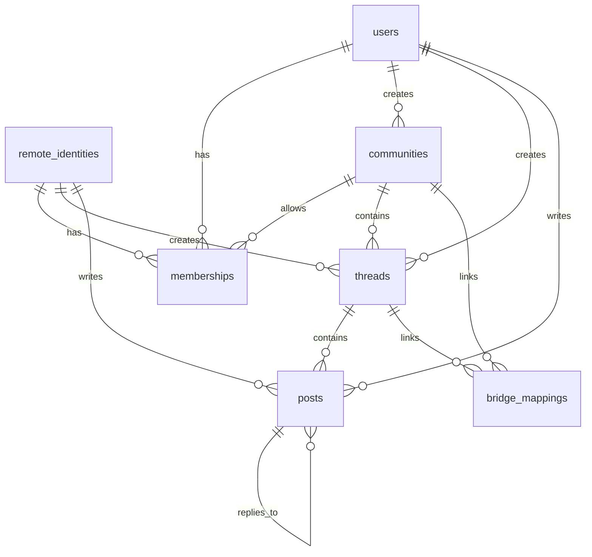

# Murmur Garden database sketch

This is a first-pass relational model for PostgreSQL.

## Core idea

Keep the local app state in a few clear tables:

- who the users are
- which identities are remote
- which communities exist
- who belongs where
- what threads and posts exist
- what federation state needs tracking

## Main tables

### `users`

Local accounts that authenticate on Murmur Garden.

Suggested fields:

- `id`
- `handle`
- `email`
- `password_hash`
- `display_name`
- `created_at`
- `updated_at`

### `remote_identities`

Federated identities from other servers.

Suggested fields:

- `id`
- `actor_uri`
- `server_host`
- `inbox_url`
- `public_key`
- `display_name`
- `created_at`
- `updated_at`

### `communities`

Discussion spaces.

Suggested fields:

- `id`
- `slug`
- `title`
- `description`
- `visibility`
- `created_by_user_id`
- `created_at`
- `updated_at`

### `memberships`

Local access rules for a user or remote identity inside a community.

Suggested fields:

- `id`
- `community_id`
- `user_id` or `remote_identity_id`
- `role`
- `can_read`
- `can_reply`
- `can_start_threads`
- `can_moderate`
- `created_at`

### `threads`

Top-level conversations inside a community.

Suggested fields:

- `id`
- `community_id`
- `title`
- `created_by_user_id` or `created_by_remote_identity_id`
- `created_at`
- `updated_at`
- `last_activity_at`

### `posts`

Individual messages in a thread.

Suggested fields:

- `id`
- `thread_id`
- `parent_post_id` for replies
- `author_user_id` or `author_remote_identity_id`
- `body`
- `visibility`
- `created_at`
- `updated_at`
- `deleted_at`

### `federation_events`

Track inbound and outbound ActivityPub work.

Suggested fields:

- `id`
- `direction` (`inbound` / `outbound`)
- `actor_uri`
- `activity_type`
- `payload`
- `status`
- `attempt_count`
- `last_attempt_at`
- `created_at`

### `bridge_mappings`

Optional links between a community/thread and an external channel.

Suggested fields:

- `id`
- `community_id`
- `thread_id`
- `bridge_type` (`whatsapp` / `sms`)
- `external_channel_id`
- `enabled`
- `created_at`

## Relationships

## Notes

- Local users and remote identities are kept separate on purpose.
- Memberships are the main authorization layer.
- Federation events should be stored so retries and auditing are possible.
- Bridge mappings should stay optional so the core forum still works without
  WhatsApp or SMS integrations.

